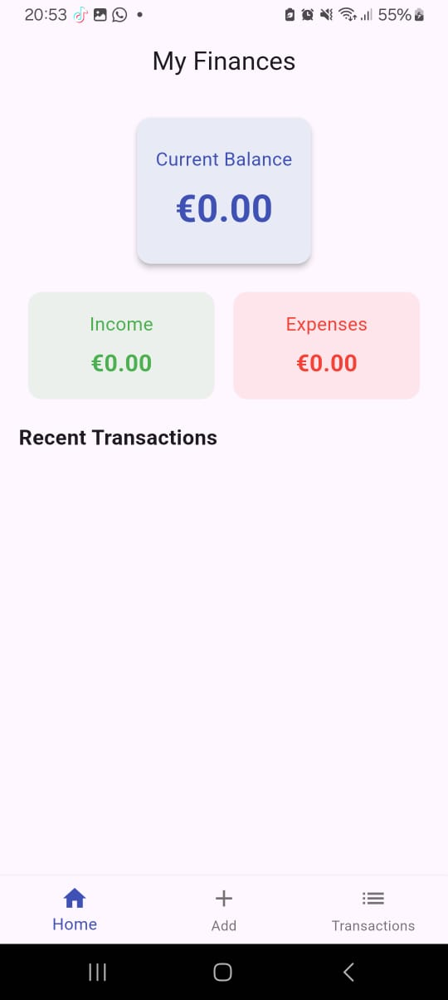
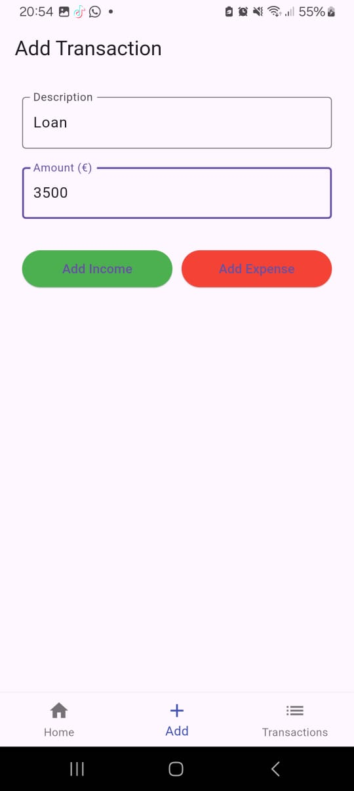
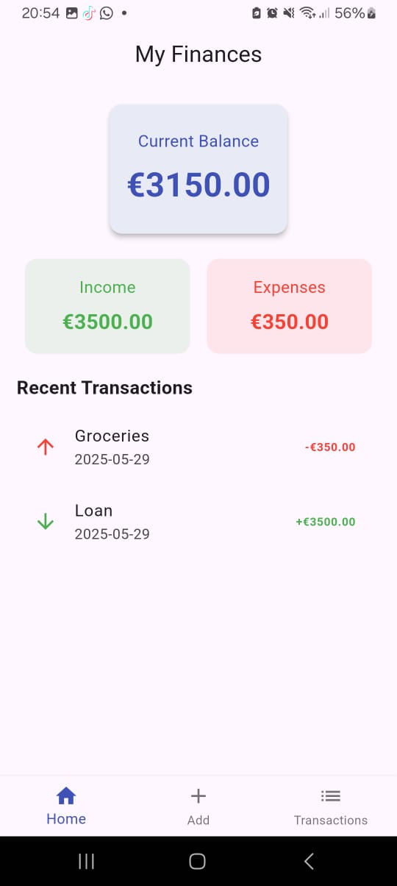

# Flutter Accounting App Demo

Hi! 👋 I'm Xhevdet, and this is a small Flutter app I built to manage income and expenses in a simple way.

I didn’t want anything complex — just something clean, fast, and easy to use. This project helped me explore how to structure a Flutter app, work with simple logic for finance tracking, and design a clear user interface.

---

## What the app does

- Add an income or an expense, with a short description
- See your current balance update instantly
- Browse a list of your latest transactions
- Enjoy a minimal, mobile-friendly interface

---

## Why I built it

There are many apps out there, but most are too heavy or packed with features I personally don’t need. I wanted something lighter — and more importantly, something I could build myself, from scratch.

This app is also part of my developer portfolio. I’m aiming to work remotely as a Flutter developer, and I wanted to show what I can do.

---

## What’s coming next

- Login system and user accounts (with Supabase)
- Visual charts for monthly stats (pie/bar)
- Export to PDF or Excel
- Sync across devices

---
Below are some screenshots showing the flow and functionality of the app:
## Screenshots

## 📸 Screenshots

### 1. Home Screen (Initial UI)
A clean and simple layout showing the current balance and quick stats — before any transactions are added.

---

### 2. Add Transaction Screen
A user-friendly form that lets you add either an income or an expense with just a couple of taps.

---

### 3. Home Screen After Adding Transactions
This screen reflects real-time data: updated balance, income/expenses summary, and a list of recent transactions.

---

## About Me

**Xhevdet Ferizi**  
📍 Kosovo  
✉️ ferizixhevdet@gmail.com  
🔗 [github.com/xheki007](https://github.com/xheki007)

---

**Note:** This project is part of my application for remote developer roles.  
**Keyword: `ELECTRIFY`**
